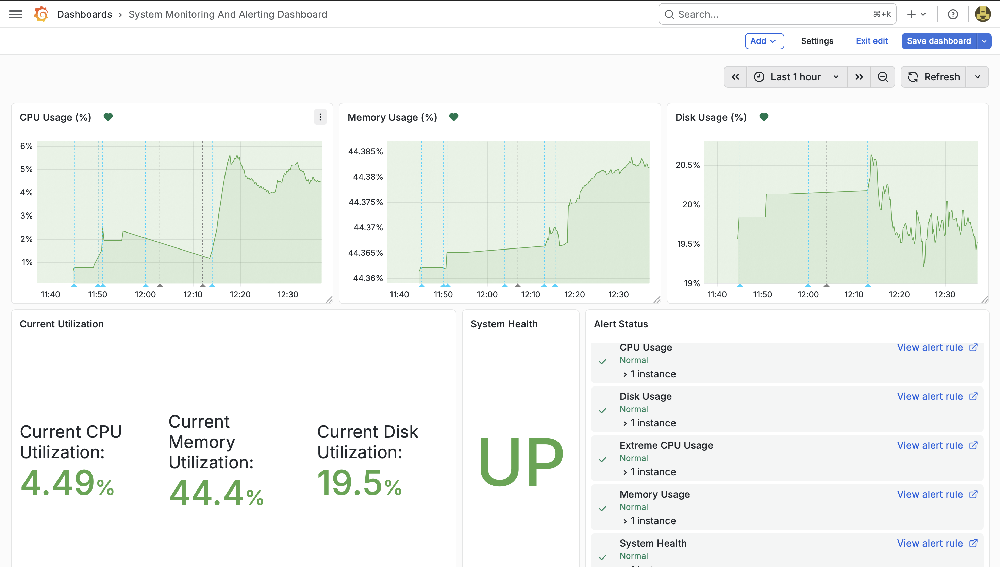

# System Monitoring & Alerting Dashboard

## Overview

This project implements a full system monitoring and alerting pipeline using **Prometheus**, **Node Exporter**, and **Grafana**. It tracks real-time system metrics and triggers alerts when resource usage exceeds defined thresholds or when the system becomes unavailable.

The goal of this project is to demonstrate practical experience with **observability**, **monitoring**, and **incident response workflows**.

---

## Features

* Real-time monitoring of:

  * CPU usage
  * Memory usage
  * Disk utilization
  * Automated alerting via SMTP email for:

  * High CPU usage
  * High memory usage
  * High disk usage
  * System downtime
* Historical metric visualization in Grafana
* System health indicator (UP/DOWN)
* Alert status panel for active and resolved alerts
* Runbook with step-by-step incident response procedures

---

## Dashboard Preview



---

## Tech Stack

* **Prometheus** – metrics collection and storage
* **Node Exporter** – system-level metric exporter
* **Grafana** – visualization and alerting
* **Docker / Docker Compose** – containerized deployment

---

## Architecture

1. Node Exporter collects system metrics
2. Prometheus scrapes metrics every 5 seconds
3. Grafana queries Prometheus for visualization
4. Alerts are triggered in Grafana based on defined thresholds
5. Notifications are sent via SMTP email

---

## Getting Started

### Prerequisites

* Docker and Docker Compose installed

### Setup

1. Clone the repository:

```bash
git clone https://github.com/your-username/system-monitoring-dashboard.git
cd system-monitoring-dashboard
```

2. Start the monitoring stack:

```bash
docker-compose up -d
```

3. Access services:

* Grafana: http://localhost:3000
* Prometheus: http://localhost:9090

---

## Alerts

Alerts are configured in Grafana with the following thresholds:

* CPU Usage > 80%
* Extreme CPU Usage > 90%
* Memory Usage > 85%
* Disk Usage > 90%
* Instance Down (`up == 0`)

Alerts are sent via SMTP email when triggered.

---

## Runbook

For incident response procedures, see:

`runbook.md`

---

